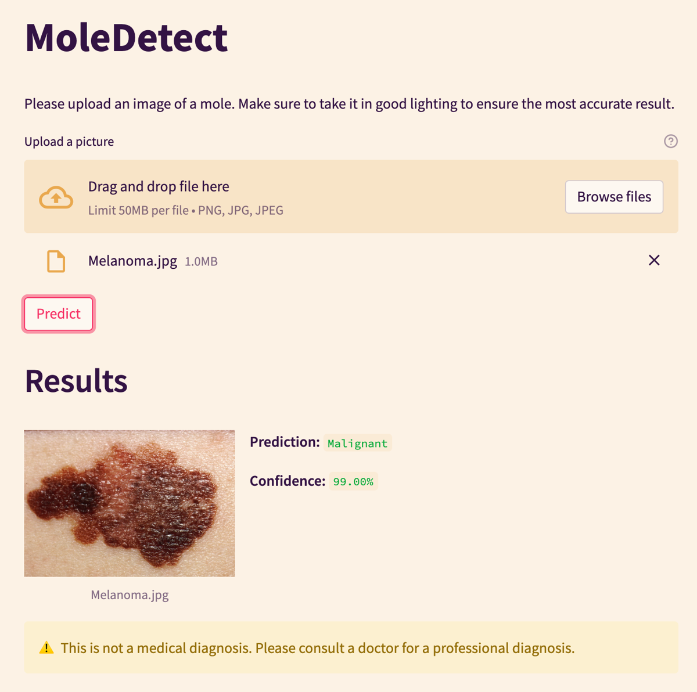

# MoleDetect

**A convolutional neural network and web app that distinguish benign moles from malignant melanoma.**

🏆 **Outstanding Statistics Project**, Curtis Jacobs Memorial Contest, Washington Statistical Society (2023–2024) · Recognized by the U.S. Air Force, MRI Global and Rockville Science Center

[**Try the live app**](https://moledetect.streamlit.app/Detect) · [Poster](https://drive.google.com/file/d/1aepZllq2kaV7w8ohMB1jLqMNOdToEdUA/view?usp=sharing)



> ⚠️ Educational screening aid only. Not a diagnosis; see a dermatologist about any concerning mole.

## Why I built it

Melanoma is the deadliest form of skin cancer and causes most skin cancer deaths in the U.S., but it is far more treatable when caught early. The problem is that many people never get checked. Researching it, I found the barriers are often not medical at all: lack of awareness, stigma, discomfort with skin exams, unequal access to care, and language differences.

I wanted to lower that barrier with something anyone could use: upload a photo of a mole and get instant feedback on whether it looks benign or worth showing a doctor. This was my first deep learning project, and it's where I learned to train and tune a CNN and ship it as a live web app.

## Model

- **Data:** 14,000+ dermoscopic images from the International Skin Imaging Collaboration (ISIC), via Kaggle ([1](https://www.kaggle.com/datasets/fanconic/skin-cancer-malignant-vs-benign), [2](https://www.kaggle.com/datasets/sallyibrahim/skin-cancer-isic-2019-2020-malignant-or-benign)); about 3:1 train/test
- **Preprocessing:** resized to 224×224, normalized, horizontally flipped
- **Architecture:** CNN inspired by AlexNet, 24 layers (6 convolutional, 4 dense), TensorFlow/Keras
- **Training:** Adam, learning rate 0.001 halved on validation-loss plateaus to 0.00001, 75 epochs on Google Colab T4 GPUs

## Results (test set)

| Metric | Result |
|---|---|
| Accuracy | 92.28% |
| Precision | 92.67% |
| Sensitivity (recall) | 91.05% |
| Specificity | 93.40% |

Training / validation accuracy: ~95% / ~90%.

## Limitations

ISIC images skew toward lighter skin tones, so performance on darker skin is not established. Next step: partner with dermatologists for more diverse data and report results by skin tone.

## Run locally

```bash
python3.10 -m venv venv     # TensorFlow 2.11 needs Python 3.7 to 3.10
source venv/bin/activate        # Windows: venv\Scripts\activate
pip install -r requirements.txt
streamlit run About.py
```

## Structure

```
About.py           landing page
pages/             Streamlit pages, including Detect
model/             trained Keras model
images/            app assets
```

## License

MIT. See [LICENSE](LICENSE).
